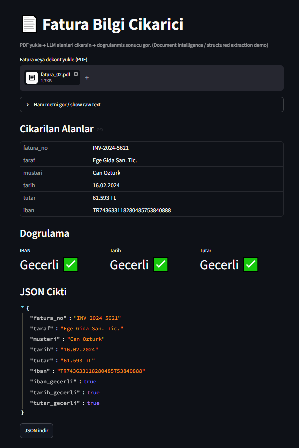

#  Fatura Bilgi Çıkarıcı / Invoice Information Extractor

> 🇹🇷 Türkçe açıklama aşağıda · 🇬🇧 English description below

---

## 🇹🇷 Türkçe

Fatura / dekont gibi yarı yapılandırılmış belgelerden **yapılandırılmış bilgi** (taraf, tarih, tutar, IBAN, fatura no) çıkaran küçük bir sistem. LLM ile çıkarım + kural tabanlı doğrulama + basit arayüz.

> Örnek olarak finansal belgeler kullandım ama sistem herhangi bir belge türüne (sözleşme, form, poliçe) uyarlanabilir.

### Ekran görüntüsü


PDF yükleniyor → alanlar otomatik çıkarılıyor → her alan doğrulanıyor (IBAN/tarih/tutar) → tablo + JSON olarak gösteriliyor.

### Sonuçlar
15 sentetik fatura üzerinde alan bazlı doğruluk:

| Alan | Doğruluk |
|---|---|
| fatura_no | 100.0% |
| taraf | 80.0% |
| musteri | 100.0% |
| tarih | 100.0% |
| tutar | 100.0% |
| iban | 100.0% |
| **Genel** | **96.7%** |

En zayıf alan `taraf` (satıcı adı) — muhtemelen satıcı/müşteri karışıklığı ve "A.Ş." gibi format farkları. Prompt netleştirme veya kısmi-eşleşme metriğiyle iyileştirilebilir. (`python evaluate.py` ile üretilir.)

### Neden yaptım (amaç)
Bankacılık ve genel NLP rollerinde sık istenen bir iş: bir belgeyi insan tek tek okumadan, içindeki kritik alanları otomatik çıkarmak. Bu proje o yeteneği (document intelligence / information extraction) gösteriyor.

### Nasıl çalışıyor (akış)
```
PDF yükle → metni çıkar (pdfplumber) → LLM alanları JSON olarak çıkarsın
         → alanları doğrula (IBAN checksum, tarih, tutar) → tablo + JSON göster
```

### Ne yaptım (teknik)
- **Metin çıkarma:** `pdfplumber` ile PDF'ten ham metin.
- **Structured extraction:** LLM'e (Groq / Llama-3.3) JSON şemasıyla soruyorum; `response_format=json_object` ile modeli **sadece JSON** döndürmeye zorluyorum → çıktı makine-okunur.
- **Doğrulama katmanı:** LLM çıktısını körü körüne kabul etmiyorum. IBAN'ı **mod-97 checksum** ile, tarihi ve tutarı format ile doğruluyorum. (Regüle ortamlarda güven için şart.)
- **Arayüz:** Streamlit ile yükle-gör; JSON indirme.
- **Test verisi:** Gerçek banka verisi PII olduğu için `gen_invoices.py` ile **sentetik** faturalar ürettim (doğru cevaplarıyla birlikte).

### Doğrulama davranışı (önemli)
Sistem LLM'in çıkardığı bilgiyi körü körüne kabul etmez:
- Geçerli belgelerde tüm alanlar **"Geçerli ✅"** işaretlenir.
- Bozuk/gerçek-dışı IBAN'lı belgelerde doğrulama katmanı **"Geçersiz ❌"** der — model doğru okusa bile matematiksel doğrulama ayrıca yapılır.

### Kurulum & Çalıştırma
```bash
# 1) sanal ortam
python -m venv venv
source venv/bin/activate        # Windows: venv\Scripts\activate

# 2) kütüphaneler
pip install -r requirements.txt

# 3) API anahtarı: .env.example -> .env yap, Groq anahtarını yaz
cp .env.example .env

# 4) örnek faturaları üret (opsiyonel, zaten hazır gelir)
python gen_invoices.py

# 5) arayüzü başlat
streamlit run app.py
```

### Dosyalar
| Dosya | Ne yapıyor |
|---|---|
| `gen_invoices.py` | Sentetik test faturaları (PDF) üretir |
| `extractor.py` | PDF'ten metin + LLM ile alan çıkarma |
| `validators.py` | IBAN/tarih/tutar doğrulama (mod-97) |
| `evaluate.py` | Alan bazlı accuracy raporu (`ground_truth.json` ile) |
| `app.py` | Streamlit arayüzü |

### Doğruluk ölçümü (evaluation)
`python evaluate.py` LLM çıktısını doğru cevaplarla karşılaştırıp **alan bazlı accuracy** verir. Ground truth sadece geliştirmede var (veriyi ben ürettim); production'da doğru cevap olmaz, orada `validators.py` checksum'larına güvenilir.

### Sonraki adımlar (yol haritası)
- Layout-aware model (LayoutLMv3 / Donut) ile taranmış belgelerde alan çıkarma.
- `ground_truth.json` ile alan bazlı accuracy raporu (`evaluate.py`).
- Docker + cloud (GCP Cloud Run / HF Spaces) ile canlı deploy.

### Teknolojiler
Python · pdfplumber · Groq (Llama-3.3) · Streamlit · reportlab

---

## 🇬🇧 English

A small system that extracts **structured information** (party, date, amount, IBAN, invoice no) from semi-structured documents like invoices and receipts. LLM-based extraction + rule-based validation + a simple UI.

> I used financial documents as an example, but the system can be adapted to any document type (contracts, forms, policies).

### Screenshot


Upload a PDF → fields are extracted automatically → each field is validated (IBAN/date/amount) → shown as a table + JSON.

### Results
Field-level accuracy on 15 synthetic invoices:

| Field | Accuracy |
|---|---|
| fatura_no | 100.0% |
| taraf | 80.0% |
| musteri | 100.0% |
| tarih | 100.0% |
| tutar | 100.0% |
| iban | 100.0% |
| **Overall** | **96.7%** |

The weakest field is `taraf` (seller name) — likely seller/customer confusion and format differences like "A.Ş.". Can be improved with prompt clarification or a partial-match metric. (Generated with `python evaluate.py`.)

### Why (goal)
A common task in banking and general NLP roles: extracting key fields from a document without a human reading it line by line. This project demonstrates that capability (document intelligence / information extraction).

### How it works (flow)
```
Upload PDF → extract text (pdfplumber) → LLM returns fields as JSON
          → validate fields (IBAN checksum, date, amount) → show table + JSON
```

### What I did (technical)
- **Text extraction:** raw text from the PDF with `pdfplumber`.
- **Structured extraction:** I prompt the LLM (Groq / Llama-3.3) with a JSON schema and use `response_format=json_object` to force **JSON-only** output → machine-readable.
- **Validation layer:** I don't blindly trust the LLM output. I validate the IBAN with the **mod-97 checksum**, and the date/amount by format. (Essential for trust in regulated settings.)
- **UI:** upload-and-view with Streamlit; JSON download.
- **Test data:** Since real bank data is PII, I generated **synthetic** invoices with `gen_invoices.py` (together with their ground truth).

### Validation behavior (important)
The system does not blindly accept the LLM output:
- For valid documents, all fields are marked **"Valid ✅"**.
- For documents with a broken/invalid IBAN, the validation layer marks it **"Invalid ❌"** — even if the model read it correctly, a mathematical check is done separately.

### Setup & Run
```bash
# 1) virtual env
python -m venv venv
source venv/bin/activate        # Windows: venv\Scripts\activate

# 2) dependencies
pip install -r requirements.txt

# 3) API key: copy .env.example -> .env and add your Groq key
cp .env.example .env

# 4) generate sample invoices (optional, already included)
python gen_invoices.py

# 5) start the UI
streamlit run app.py
```

### Files
| File | What it does |
|---|---|
| `gen_invoices.py` | Generates synthetic test invoices (PDF) |
| `extractor.py` | Text from PDF + field extraction with the LLM |
| `validators.py` | IBAN/date/amount validation (mod-97) |
| `evaluate.py` | Field-level accuracy report (against `ground_truth.json`) |
| `app.py` | Streamlit UI |

### Evaluation
`python evaluate.py` compares the LLM output against the ground truth and reports **field-level accuracy**. Ground truth only exists in development (I generated the data); in production there is no answer key, so we rely on the checksum validation in `validators.py`.

### Next steps (roadmap)
- Layout-aware models (LayoutLMv3 / Donut) for scanned documents.
- Field-level accuracy report using `ground_truth.json` (`evaluate.py`).
- Docker + cloud deployment (GCP Cloud Run / HF Spaces).

### Tech stack
Python · pdfplumber · Groq (Llama-3.3) · Streamlit · reportlab